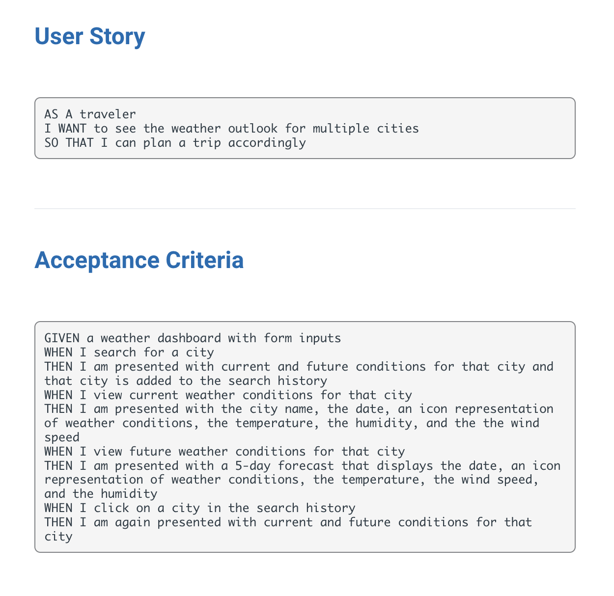
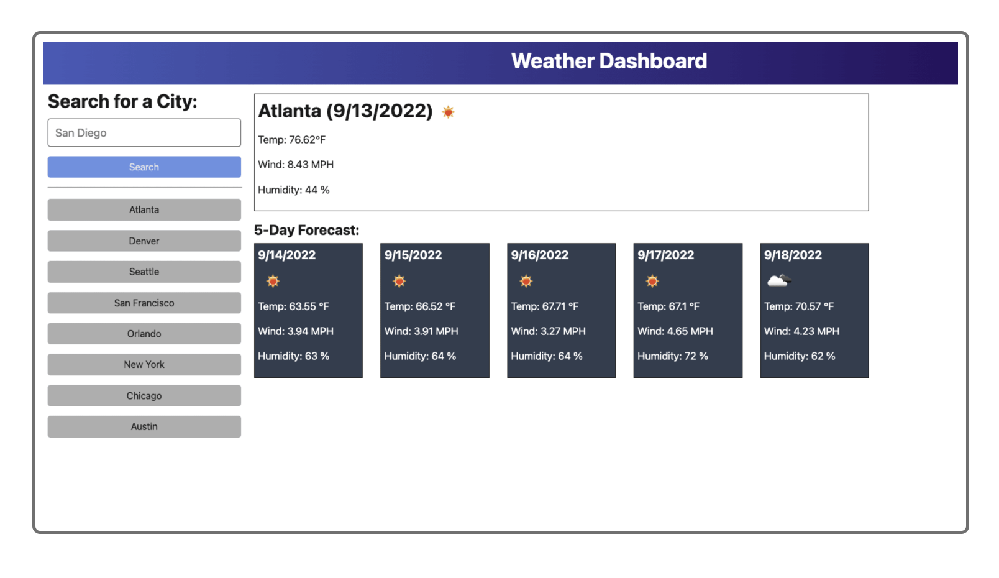
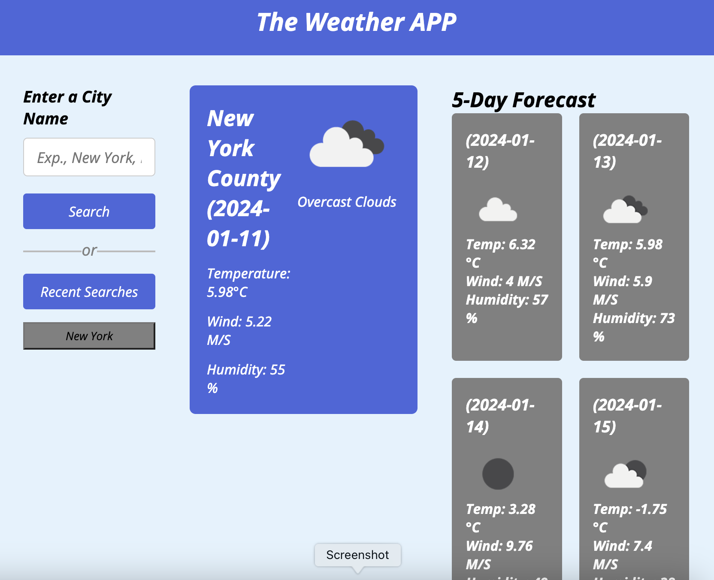
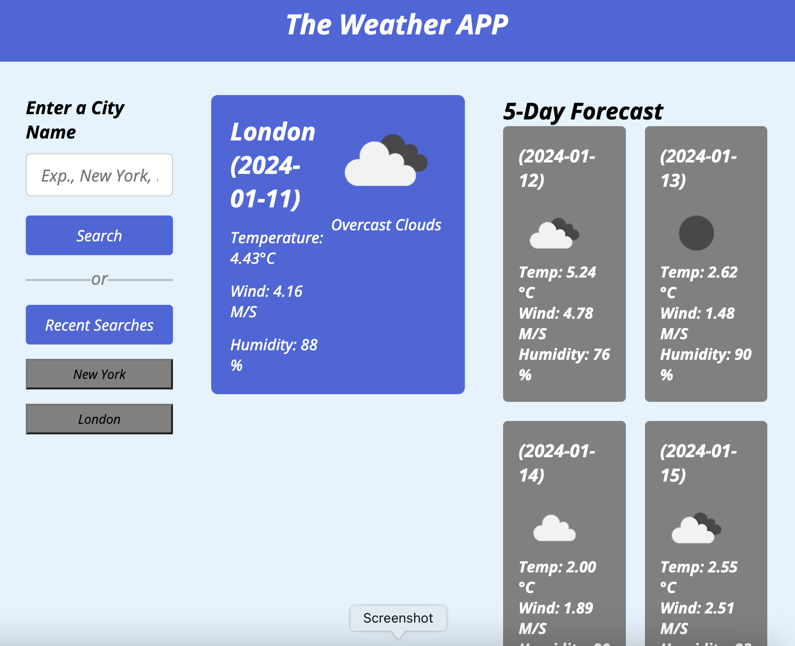

# The Weather APP 

Sunshine or Rain 

## Description

The Weather App is an app where you can see the five-day weather forecast for the city  or town you plan to visit. Sunshine or rain enjoy every moment.

Below is the User Story and Acceptance Criteria required for app to functionalize. 

Given Example 

## Features 

The Weather App is a functional app for keeping track on the weather forecast. It features five day weather forecast for the city or town.

In the left side of the app you will find the search bar with button, when you enter a city name and click on the search it will give you the weather forecast for the day. 
On the right side there is a display block for the daily weather forecast and next to it threre are additional four blocks for the next four days. 

Below the search bar you will be able to see the history of recently searched cities. When you click on the city name button it will give you the weather forecast for that city. 

We used the [OpenWeatherMapAPI](https://openweathermap.org/api) and geographical coordinates to retrieve the weather data for the cities. 

In addition we used the localStorage to save the history and display when called.

This application runs in the browser and features dynamically updated HTML and CSS.

Also it includes the following file structure: 

HTML page - index.html
assets file - CSS page - style.css and JavaScript page - script.js 
Images folder.

## Summrary 

The Weather APP runs functionally with the given directions. Hope you use and like our app in your future trips. 
Sunshine or Rain enjoy every little moment. 

 

## Deployment Link 

https://dileknrdn.github.io/the-weather-app/

## Author 

Dilek Nuredin 

[GitHub](https://github.com/dileknrdn)